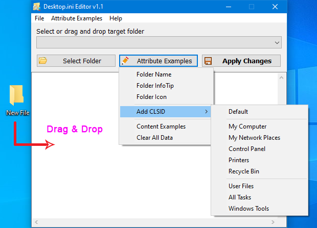

<!--
This is a comment and will not be displayed
---------
Images need to be displayed using relative paths
---------
# This is a level 1 heading
## This is a level 2 heading
### This is a level 3 heading
#### This is a level 4 heading
##### This is a level 5 heading
###### This is a level 6 heading
**Bold**
*Italic*
***Bold and Italic***
~Strikethrough~
 is quoted content. Quotes can be nested
---Divider

[Hyperlink name](hyperlink address "Hyperlink title")
- Unordered list item
1. Ordered list item
Table header|Table header|Table header
---|:--:|---:
Content|Content|Content
Content|Content|Content
`Single line code`
``` 
Multi-line code
```
Markdown usage guide ends here
-->

## **前言**

我本人在电脑上存储了大量的图片，包括但不限于家庭历史图片归档、旅行图片、风景图片、壁纸、色图等。随着时间的推移，我会逐渐忘记了这个文件夹下的图片内容，在后续的查找中会非常低效。并且整体的存储就看起来非常的不优雅，毕竟windows自带的文件夹缩略真的是一言难尽。

也尝试过一些第三方的工具，比如在线的图库之类的：[Zfile](https://github.com/zfile-dev/zfile) 之类的。最终这类工具也都有个非常难以克服的缺点：没法像系统原生的文件资源管理器那样流畅和操作便捷。

让我突然发现windows的文件夹可以自定义icon时，我就想到了一个简单的方案：用文件资源管理器来做图库。

示例如下：

## **方案详述**
整体的方案就是通过 windows的自定义文件夹功能来实现，通过编写 [desktop.ini](https://learn.microsoft.com/en-us/windows/win32/shell/how-to-customize-folders-with-desktop-ini) 文件来实现。

一个简单的 desktop.ini 文件如下所示：
```
[.ShellClassInfo]
IconResource=159d0308e4890a29d595bc835be70184.ico,0
Flags=0
[ViewState]
Mode=1
Vid={8BEBB290-52D0-11D4-B9DA-00C04F79DBC0}
```
其中 IconResource 就是我们要设置的文件夹图标，可以是 .ico 格式的文件，也可以是 .exe 或者 .dll 里面的图标资源。

Flags=0 代表使用自定义的图标。
Mode=1 代表使用大图标模式。
Vid={8BEBB290-52D0-11D4-B9DA-00C04F79DBC0} 代表使用缩略图预览。

在实际使用时还是发现了几个问题：
 - desktop.ini 文件必须是隐藏和只读属性，否则不会生效。
 - icon资源必须存在本地磁盘上，不能是网络路径。哪怕做了磁盘映射都不行。
 - icon资源的路径不能包含非英文字符。（可能是我文件编码没做对，这也懒得搞了）
 - 文件夹图标的缩略图存在缓存没更新那么快。
 - 文件夹图标的缩略图不能太大，太大会显示不出来。一般ico图片的话我尝试过最大的是512*512。

遵循这些规则，其实已经能写一个脚本用于批量创建每个文件夹的图标了。

## **更进一步方案**

尽管用了脚本来生成desktop.ini文件，还是存在大量问题，比如缓存问题，或者是突然不生效（微软的屎山代码）。
在我认为走进了死胡同的时候，发现了一个很有用的软件：[desktop-ini-editor](https://www.sordum.org/10084/desktop-ini-editor-v1-1/)。

这个软件可以直接编辑 desktop.ini 文件，并且可以通过命令行来操作。这样就可以直接通过脚本来调用这个软件来生成 desktop.ini 文件，并且这个软件会自动处理好各种属性和缓存问题。

```
Usage: DeskEdit.exe <command>
/F:Target folder path
/I: Ini file Overwrite Target folder ini file
/S:Target section in desktop.ini file
/L:Add line in target section
/D:Delete desktop.ini file in the target folder
Samples:
DeskEdit.exe /F=C:(Folder /I=C:(Other(Sample.ini
DeskEdit.exe /F=C:(Folder /I=C:(Other(Sample.txt
DeskEdit.exe /F=C:(Folder /S=.ShellClassInfo "/L=IconResource=%SystemRoot%\system32\shell32.dll,13"
DeskEdit.exe /F=C:(Folder /S=.ShellClassInfo /L=LocalizedResourceName=FolderName
DeskEdit.exe /F=C:(Folder /D
DeskEdit.exe /F=C:(Folder /S=.ShellClassInfo /L=IconResource
```




基于这个软件，再写自己的封面生成逻辑，就可以实现一个非常完美的个人图库方案了。

## **一些备注**

示例图片是借影视飓风的示例图片，感谢影视飓风。

如果有人需要参考下我写的脚本，可以直接回复，或者是发邮件，我发你一份。
